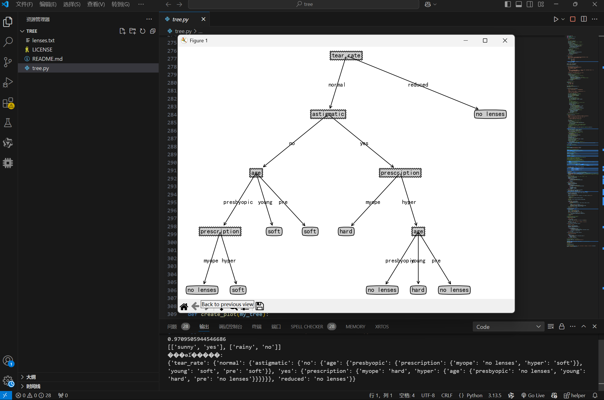
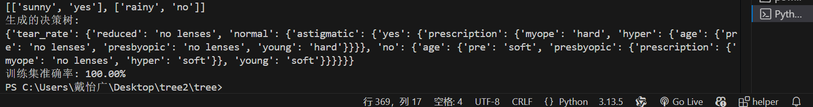

# 作业：使用 ID3 决策树预测隐形眼镜类型

## 任务目标
使用 `lenses.txt` 数据集训练一个 **ID3 决策树**，预测隐形眼镜类型。

## 数据说明
- 文件：`lenses.txt`
- 特征：`age`, `prescription`, `astigmatic`, `tear_rate`
- 标签（最后一列）：`hard`, `soft`, `no lenses`

## 作业内容
1. 阅读 `tree.py` 中的 ID3 实现与绘图代码；
2. 完善加载数据集、训练决策树、预测与评估的部分；
3. 绘制生成的决策树并截图；
4. 计算训练集准确率并打印；

## 提交方式
1. Fork 本仓库；
2. 在你自己的仓库中完成实验；
3. 提交并推送；
4. 发起 Pull Request，标题为 `学号-姓名-决策树`

